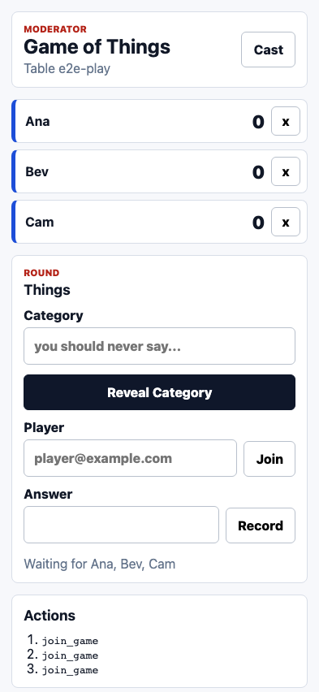
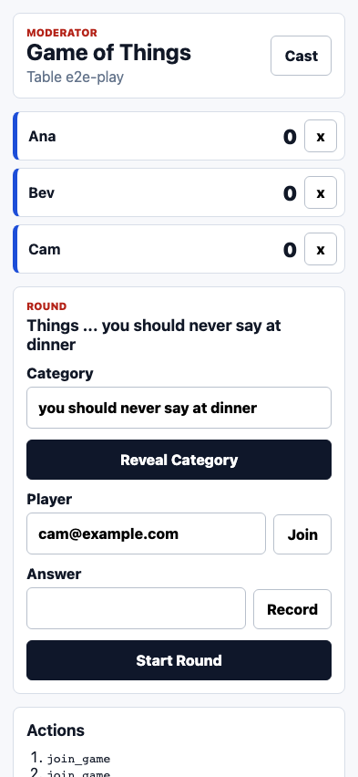
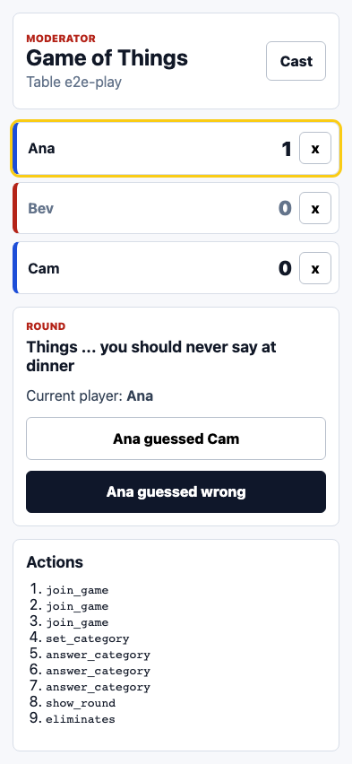

# Test: Play a round

The moderator creates a category, records answers, and scores guesses.

## Players joined the table

**Verifications:**
- [x] Ana is listed
- [x] Bev is listed
- [x] Cam is listed

---

## All answers are recorded

**Verifications:**
- [x] Start Round is available
- [x] Answer actions are replayed

---

## Moderator scores a correct guess

**Verifications:**
- [x] Current player is visible
- [x] Elimination action recorded

---

